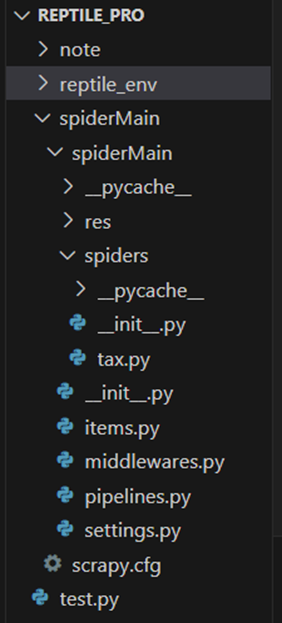

## 爬虫使用说明

**author: Alla**

<br/>

### 1. 运行爬虫
爬虫需要在windows环境下运行，python版本3.0及以上

1. 切换pip为清华源
`pip config set global.index-url https://pypi.tuna.tsinghua.edu.cn/simple`
2. 设置虚拟环境：不介意python包下载到根环境的可以跳过这步。其中reptile_env是环境名
`python -m venv reptile_env`
3. 进入虚拟环境
    ```
    [window] .\reptile_env\Scripts\activate
    [linux/mac] source .\reptile_env\bin\activate
    ```
4. 通过requirements.txt下载包
`pip install -r requirements.txt`
5. 记得使用selenium需要下载驱动（使用了chrome驱动），并将驱动地址放在系统变量的Path中。建议搜索并下载
6. 进入爬虫文件夹，不进入则无法使用scrapy命令（第6步）
`cd ./spiderMain`
7. 运行爬虫：控制台第一次运行时，chrome加载可能较慢，请耐心等待
`scrapy crawl tax` <br/>
如果嫌弃爬虫log太多，则使用`scrapy crawl tax --nolog`
 
p.s.如果想让爬虫的items输出到一个json文件，则使用以下命令
`scrapy crawl tax -o xx.json`

### 2. 爬虫/spiderMain的项目架构
<div align=center></div>

&emsp;&emsp;&ensp; scrapy.cfg：项目的配置文件 <br/>
&emsp;&emsp;&ensp; spiderMain/：项目的Python模块，将会从这里引用代码 <br/>
&emsp;&emsp;&ensp; spiderMain/spiders/tax.py：爬虫本体文件 <br/>
&emsp;&emsp;&ensp; spiderMain/items.py：项目的items文件，定义爬虫抓取的数据结构 <br/>
&emsp;&emsp;&ensp; spiderMain/pipelines.py：项目的pipelines文件，处理爬虫返回的item数据 <br/>
&emsp;&emsp;&ensp; spiderMain/settings.py：项目的设置文件 <br/>
&emsp;&emsp;&ensp; spiderMain/spiders/：存储爬虫的目录 <br/>
### 3. 开发爬虫
本部分是开发者需要注意的
1. 找到目标网站的网址：如http://beijing.chinatax.gov.cn/bjsat/office/jsp/zdsswfaj/wwquery.jsp
2. 分析获取数据的方式，使用selenium模拟操作结合xpath获取网页数据（具体看教师word文档的2.2-2.4，同时/note/开发说明.word中有基于本项目的详细说明）
3. 在tax.py中写代码并测试
4. 如果新加了依赖包：生成requirements.txt
   1. 使用`pip freeze > requirements.txt`，会把所有库都保存（包括多余的）。但本人使用此种才能成功
   2. 采用第三方包pipreqs
&ensp;*Step 1* 安装pipreqs：`pip install pipreqs` <br/>
&ensp;*Step 2* 终端输入：`pipreqs ./` 