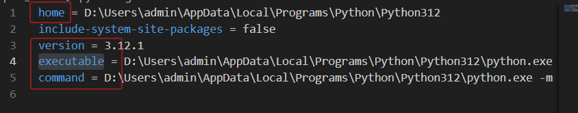
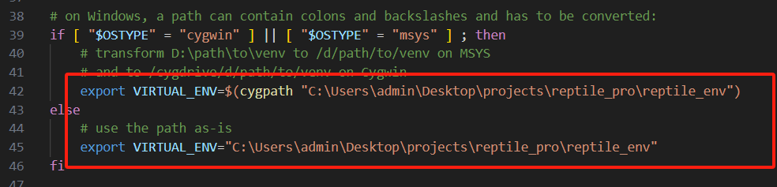
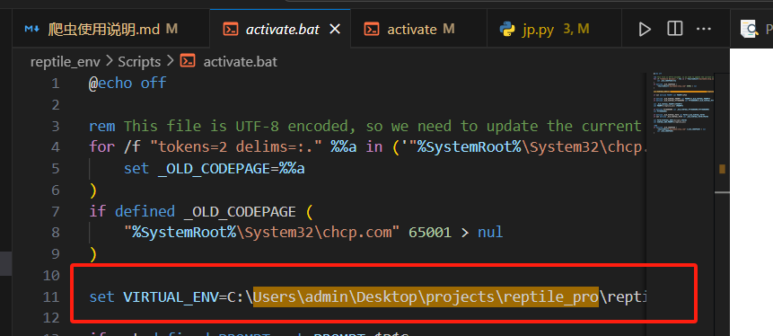
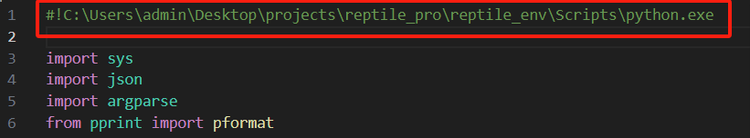

虚拟环境相关修改。不用看。这个解决不了虚拟环境迁移失败的问题。

1. 修改虚拟环境配置：将虚拟环境的配置文件/reptile_env/pyvenv.cfg中的`home`, `version`, `executable`, `command`四个属性与本电脑的python路径一致，最后`command`的`venv`后字符串要改为本电脑项目**虚拟环境**（reptile_venv）的绝对路径 

2. 将/reptile_env/Scripts/activate中的以下命令行修改为本电脑项目**虚拟环境**（reptile_venv）的绝对路径

3. 将/reptile_env/Scripts/activate.bat中的本行代码改为本电脑项目**虚拟环境**（reptile_venv）的绝对路径

4. 将/reptile_env/Scripts/jp.py的首行注释修改为虚拟环境（reptile_venv）中python.exe的绝对路径（**相对路径：/reptile_env/Scripts/python.exe）**

