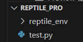
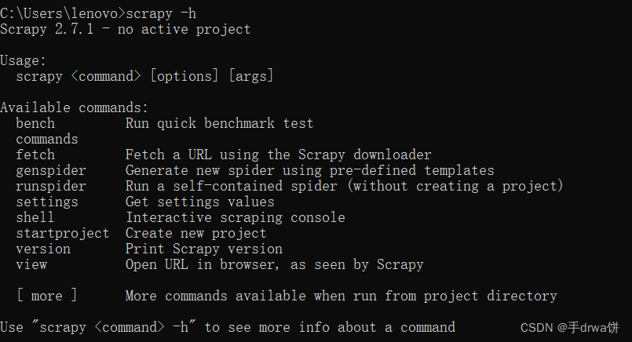
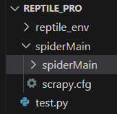
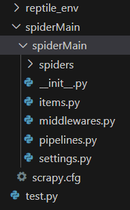

## 框架搭建流程

**author: Alla**

<br/>

### 1. 创建Python环境
1. 首先安装python，选择"add xxx to path"节约设置环境变量时间；在cmd中使用`python -version`测试能否使用
2. 安装vscode或者pycharm，针对自己的电脑和软件进行debug
3. 确保pip能使用，一般都行（不行的话，跳转本页 5.参考文章[1]）

### 2. 创建虚拟环境
隔离电脑本地的环境，以下均使用控制台操作
1. 创建虚拟环境的方法：其中reptile_env是环境名
`python -m venv reptile_env`
2. 进入环境的方法
 `.\reptile_env\Scripts\activate`
3. 正确的结果
命令行左侧环境出现 `(reptile_env)`
4. 这时，项目架构已经变为
<div align=center></div>

### 3. 依赖安装
> 老师给的文件《Scrapy入门文档》表示：<br/>
安装时，python的版本和包的版本要对应<br/>
Windows: 5.参考文章[1] <br/>
Linux: `pip install scrapy`

由于本人是windows机，以下均为win环境的写法

1. 将pip下载源切换为清华源（`pip config set global.index-url https://pypi.tuna.tsinghua.edu.cn/simple`），一方面速度快、另一方面包多（阿里源不含 pywin32 和 twisted）
2. 使用`pip install pywin32`和`pip install twisted`，win环境缺少这两个将无法下载scrapy
3. 依然在控制台，使用`scrapy -h`查看是否安装成功，下图为成功情况；若“出现'scrapy 不是内部或外部命令，也不是可运行的程序或批处理文件”，可能是python的环境变量没配置成功
<div align=center></div>

4. 依然在控制台。在**工作目录**下，输入`scrapy startproject spiderMain`，其中spiderMain是本人使用scrapy框架建的项目名
5. 这时，项目结构已经变成了如下的图<br/>
<div align=center></div>
&emsp;&emsp;&ensp; spiderMain的spiderMain展开后如下所示<br/>
<div align=center></div>

&emsp;&emsp;&ensp; 各个文件的作用：<br/>
&emsp;&emsp;&ensp; scrapy.cfg：项目的配置文件 <br/>
&emsp;&emsp;&ensp; spiderMain/：项目的Python模块，将会从这里引用代码 <br/>
&emsp;&emsp;&ensp; spiderMain/items.py：项目的items文件，定义爬虫抓取的数据结构 <br/>
&emsp;&emsp;&ensp; spiderMain/pipelines.py：项目的pipelines文件，处理爬虫返回的item数据 <br/>
&emsp;&emsp;&ensp; spiderMain/settings.py：项目的设置文件 <br/>
&emsp;&emsp;&ensp; spiderMain/spiders/：存储爬虫的目录 <br/>
 <br/>
&emsp;&emsp;&ensp; **爬虫开发人员只需开发spiders文件夹中的爬虫**

6. 由于本项目爬虫涉及到表单的发送和按钮获取，使用selenium辅助开发
`pip install selenium`

### 4. 创建并测试基本爬虫
在本项目的架构上，在控制台输入以下两条命令
```shell
cd spiderMain
scrapy genspider tax "hd.chinatax.gov.cn/xxk/"
```
其中tax是爬虫的名字，不能是“scrapy”或工程（即SpiderMain）的名字；"hd.chinatax.gov.cn/xxk/"是目标网站，如果是类似“www.baidu.com”的域名可以省略二级域名“www”。<br>
此时，/spiderMain/spiders/文件夹下多了一个tax.py。<br>
✨<br>
接着修改tax.py！
具体请阅读软件架构.word等文档<br>

### 5. 参考文章
[[1] windows下scrapy 的安装](http://www.cnblogs.com/tigerm/p/scrapy.html)

[[2] python爬虫之——Scrapy框架学习](https://blog.csdn.net/qq_50520874/article/details/128457878)

[[3] ??](htt)